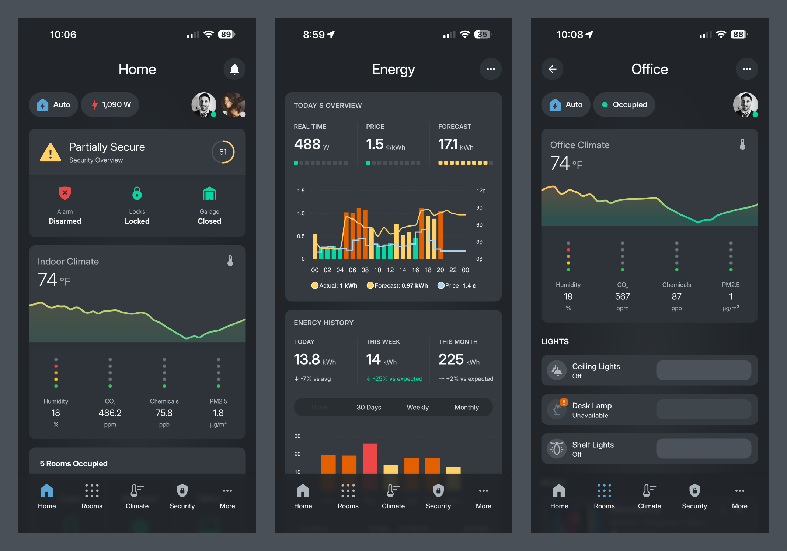

# Home Assistant Configuration

[Home Assistant](https://home-assistant.io/) is the core of my smart home system. This repo includes all the custom packages, sensors, and automations that power my house. It's a work in progress and is constantly evolving. 

## Deployment

Home Assistant OS is deployed on a [Home Assistant Yellow](https://www.home-assistant.io/yellow/) (this is temporary while I migrate infrastructure). I also use [Nabu Casa](https://www.nabucasa.com/) for remote access and to support the project.

## Key Software

- [Home Assistant](https://home-assistant.io/)
- [Z-Wave JS UI](https://zwave-js.github.io/zwave-js-ui/) for Z-Wave device management
- [Zigbee Home Automation (ZHA)](https://www.home-assistant.io/integrations/zha/) for Zigbee devices
- [ESPHome](https://esphome.io/) for custom sensors and devices
- [Mosquitto](https://mosquitto.org/) for the MQTT broker

---

## Documentation

| Document | Description |
|----------|-------------|
| [Rooms](docs/ROOMS.md) | Room modes, state management, and customization |
| [People](docs/PEOPLE.md) | Person sensors, presence states, sleep tracking |
| [Presence Detection](docs/PRESENCE.md) | Home, room, and zone presence detection setup |
| [Automations](docs/AUTOMATIONS.md) | Speech notifications and favorite automations |
| [Devices](docs/DEVICES.md) | Complete hardware inventory with links and notes |
| [Dashboard](dashboards/README.md) | Custom Lovelace dashboard system (Kohbo) |

---

## Architecture

My Home Assistant configuration is architected a bit differently than many other configs. I was heavily influenced by [Tinkerer's](https://github.com/DubhAd/Home-AssistantConfig) configuration, which I recommend you check out. Instead of large, complex automations that do many things, my configuration is split into hundreds of smaller automations, scripts, and sensors. For example, many home assistant setups have an automation that turns offs all the lights in the house when it's not occupied. In my configuration, when the house is not occupied, an automation for each room is triggered that effectively turns that room off, including the lights, media, and anything else that shouldn't be on.

You can think of my smart home as a collection of smart rooms. Most rooms have an `input_select` that manages the state of the room. For example, [my office](packages/office/office_state.yaml) has the following states:

- **Auto**: Automations are enabled, i.e., motion lighting, media, etc.
- **DnD**: Do Not Disturb turns on a red light outside my Office, turns off voice notifications, and turns off any music playing in the Office. 
- **Off**: No automations, just a regular, dumb room.

Automations within a room are determined and controlled by the room's state and available automations. The house also has state (see [house.yaml](input_select/house/house.yaml)). The house also has a variety of meta properties that are controlled by `input_booleans`, for example:

- **House Occupied** (`input_boolean.house_occupied`): This boolean is triggered by people being home or away. Check out [this automation](packages/house/occupancy/house_occupied.yaml) for reference. A bunch of other automations are triggered by changes in this boolean. For example, the state of the house will change to `Away` when not occupied, and other rooms will also turn off.
- **Guest Mode** (`input_boolean.guest_mode`): This boolean is triggered when guests are present. Various automations check to see if guest mode is enabled to activate or modify conditions.
- **Quiet Mode** (`input_boolean.quiet_mode`): If any of the kids are sleeping, this boolean will turn on and change the house state to "Quiet." For example, this will prevent the doorbell from ringing and lower the TTS device volumes.
- **Lighting Automations** (`input_boolean.lighting_automations`): This boolean will enable or disable lighting automations across the house. If this is off, then no lighting automations should trigger. Some rooms have their own property to manage lighting automations within the room.
- **Speech Notifications** (`input_boolean.speech_notifications`): A way to globally turn on/off voice notifications throughout the house.
- **Bad Weather** (`input_boolean.bad_weather`): Triggered when the weather outside isn't great. Various rooms will react to this boolean. For example, the foyer chandelier will turn on when the weather is bad since it gets dark by the stairs. 

Some of these booleans have two automations to manage state: one that is triggered and turns the boolean on and another that turns the boolean off. For example, check out the [bad weather automations](packages/weather/). Some of these are only changed through the UI. For example, speech and lighting automations are rarely used but are helpful when I need to turn them off without much effort. 

For more details on how rooms and people work, see:
- [Rooms](docs/ROOMS.md) - Room modes, state transitions, and customization
- [People](docs/PEOPLE.md) - Person sensors, sleep states, and presence

---

## Dashboard

I built a custom dashboard system called **Kohbo** with reusable templates and consistent design patterns. It's optimized for mobile and wall-mounted tablets with a dark-first design.

Key sections: Home, Rooms, Climate, Security, Energy, People

For full documentation, see [Dashboard](dashboards/README.md).

---

## Highlights

Some of my favorite automations (full list in [Automations](docs/AUTOMATIONS.md)):

- **Climate** - HVAC adjusts based on hourly energy pricing
- **Bedtime Mode** - House locks down when everyone's in bed
- **Entertainment Mode** - Reduces automations when hosting guests (WAF optimization)
- **Smart Garage** - Auto-close when unoccupied, remote locking at night
- **Camera Notifications** - Context-aware alerts based on time, occupancy, and conditions
- **Morning Update** - Daily TTS briefing with weather, calendar, and school info

---

## Devices

I have a pretty extensive device list including Zigbee/Z-Wave hubs, Lutron lighting, Nest thermostats, Sonos audio, Unifi cameras, and more.

For the complete inventory, see [Devices](docs/DEVICES.md).
