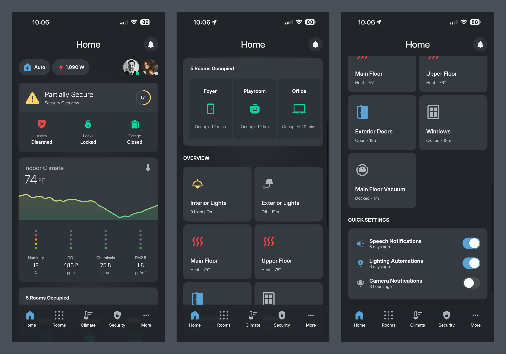
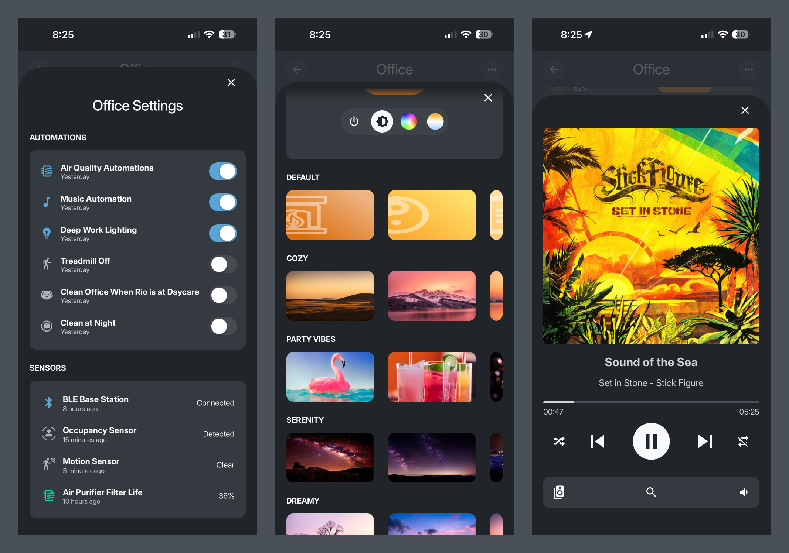
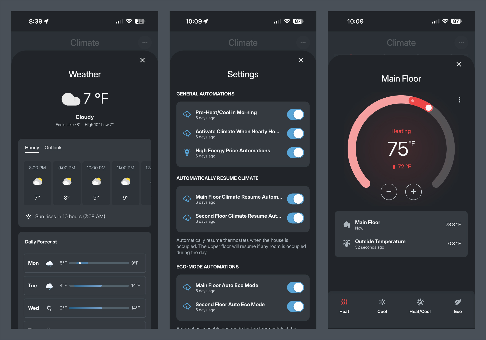
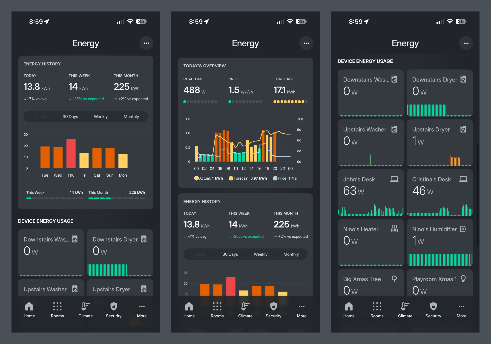

# Kohbo Dashboard Gallery

A visual tour of the Kohbo Home Assistant dashboard.

---

## Dashboard Overview

The main dashboard system — a custom Home Assistant interface built with reusable templates and consistent design patterns. Optimized for dark-first design and mobile-friendly viewing.

[View full documentation →](./README.md)

---

## Home

The main landing page providing quick access to key controls, house status, security overview, climate monitoring, and navigation to all major sections.

[View full documentation →](./kohbo/home/README.md)

---

## Rooms

Room-by-room control organized by floor. Browse active/occupied rooms or view all rooms with quick status cards showing temperature, occupancy, and key devices.

[View full documentation →](./kohbo/rooms/README.md)

---

## Room Details

Individual room control pages with climate overview, lights, music, devices, and quick settings. Each room follows a consistent layout with full control capabilities.

[View full documentation →](./kohbo/rooms/README.md#room-detail-pages)

---

## Room Popups

Detailed popups for room settings, scene selection, media players, and climate graphs. Scene presets provide Hue-like lighting control for any color-capable lights.

[View full documentation →](./kohbo/rooms/README.md#popups)

---

## Climate

Comprehensive climate control with floor-level temperature graphs, air quality monitoring, HVAC controls, radiant floor heating zones, and room temperature cards.

[View full documentation →](./kohbo/climate/README.md)

---

## Climate Popups

Weather forecasts, thermostat controls, and detailed climate information including precipitation, AQI, allergies, and sun/moon phases.

[View full documentation →](./kohbo/climate/README.md#popups)

---

## Security

Centralized security monitoring with real-time security score, alarm panel, locks, garage doors, exterior doors, windows, and motion detection.

[View full documentation →](./kohbo/security/README.md)

---

## House Locks

Lock controls for front door and garage entry with history logs and automation settings.

[View full documentation →](./kohbo/security/README.md#house-locks-pagehouse_locksyaml)

---

## Garage Doors

Three garage door controls with autoclose automations and remote lock settings.

[View full documentation →](./kohbo/security/README.md#garage-doors-pagesgarage_doorsyaml)

---

## Security Cameras

Live camera feeds with motion detection status. Tap any camera for full-screen viewing and controls.

[View full documentation →](./kohbo/security/README.md#cameras-camerascamerasyaml)

---

## Energy

Real-time energy monitoring with dynamic forecasting, price tracking, and historical usage comparisons. Predicts end-of-day consumption based on current patterns.

[View full documentation →](./kohbo/energy/README.md)

---

## People

Presence tracking for household members showing who's home, room locations, device status, sleep states, and person-specific automations.

[View full documentation →](./kohbo/more/PEOPLE_README.md)

---

*For detailed documentation, see the [main README](./README.md) or individual section READMEs.*
