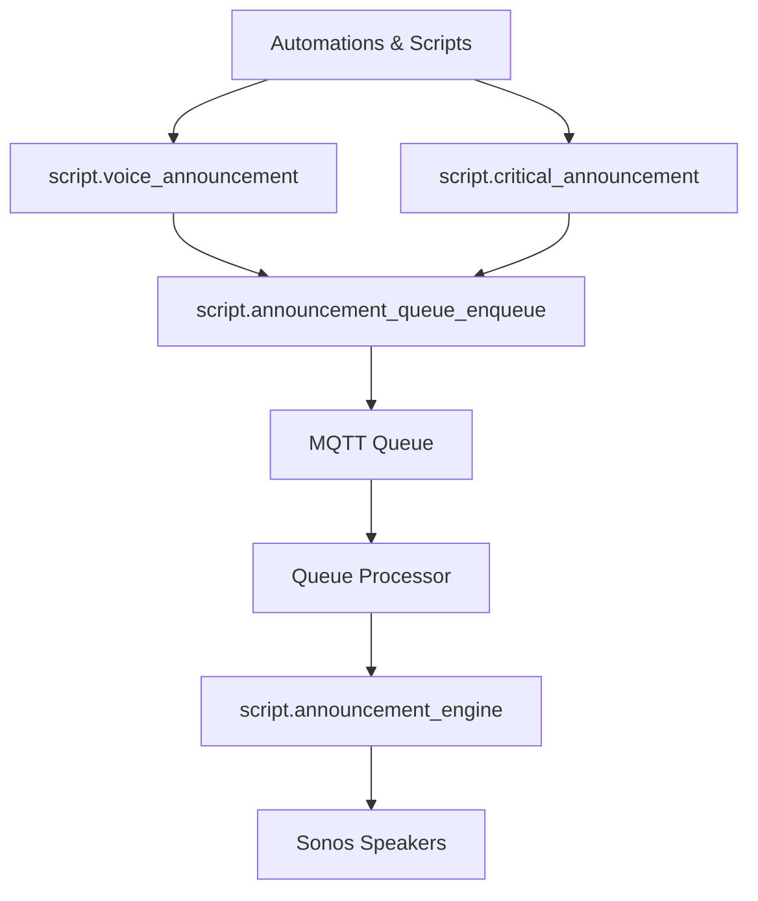

# Voice Announcements

[Back to main README](../README.md)

This document explains the voice announcement system in my Home Assistant configuration.

## Overview

Voice gives the house a personality! The announcement system broadcasts TTS (text-to-speech) messages through Sonos-powered in-ceiling speakers throughout the house. Announcements are room-aware, meaning they only broadcast to occupied rooms unless it's a critical alert.

Key features:
- **Nabu Casa Cloud TTS** for speech synthesis
- **Sonos announce** feature for non-interruptive playback (music ducks and resumes)
- **Room-aware broadcasting** to occupied rooms only
- **Priority queue** to prevent overlapping announcements
- **Customizable chimes** including person-specific intro sounds

---

## Architecture

The announcement system uses a layered architecture. Automations call wrapper scripts that handle logic like room selection and sound mapping, which feed into a queue system, and finally the core engine broadcasts the audio.



---

## Services

| Script | Purpose |
|--------|---------|
| `script.voice_announcement` | Primary TTS wrapper. Handles sound mapping, room-awareness, volume adjustment, and priority. |
| `script.critical_announcement` | Emergency broadcasts. Ignores occupancy, uses louder volume and alarm sound. |
| `script.announcement_engine` | Low-level engine that plays the chime and TTS via Sonos announce. |
| `script.repeat_last_voice_announcement` | Replays the most recent announcement stored in `input_text.latest_voice_announcement`. |

---

## Voice Announcement

The `script.voice_announcement` is the primary way to trigger TTS throughout the house.

### Parameters

| Parameter | Description | Default |
|-----------|-------------|---------|
| `speech_message` | The TTS message to broadcast | Required |
| `sound` | Chime sound to play before the message | `default` |
| `media_players` | Target speakers: `auto` for occupied rooms, `all`, or specific entity | `auto` |
| `priority` | Message priority: `critical`, `high`, `normal`, `low` | `low` |
| `expires_in` | Minutes until message expires (useful for time-sensitive reminders) | Based on priority |

### Example Usage

Basic announcement to occupied rooms:

```yaml
- action: script.voice_announcement
  data:
    media_players: auto
    sound: "one-chime"
    speech_message: "The upstairs washer is done and ready to be emptied."
```

Person arrival with custom intro sound:

```yaml
- action: script.voice_announcement
  data:
    media_players: auto
    sound: "alex"
    speech_message: "Alex just arrived home."
```

High-priority announcement that doesn't expire:

```yaml
- action: script.voice_announcement
  data:
    media_players: auto
    sound: "fanfare"
    speech_message: "Happy birthday!"
    priority: high
```

---

## Critical Announcement

The `script.critical_announcement` is for emergencies like fire, smoke, or water leaks. It differs from regular announcements:

- Broadcasts to **all rooms** regardless of occupancy
- Uses a **nuclear alarm** sound
- **Clears the queue** of non-critical messages
- Ignores time-of-day restrictions

```yaml
- action: script.critical_announcement
  data:
    media_players: all
    speech_message: "Warning! Water leak detected in the basement."
```

---

## Smart Behaviors

The announcement system has built-in intelligence to avoid being annoying:

| Behavior | Description |
|----------|-------------|
| **Time restrictions** | Only broadcasts between 6 AM and 11 PM |
| **Bedtime mode** | No announcements when `input_boolean.bedtime` is on |
| **Global toggle** | Respects `input_boolean.speech_notifications` |
| **Quiet mode** | Reduces volume by 50% when `input_boolean.quiet_mode` is on |
| **Music-aware** | Low/normal priority messages skip rooms actively playing music |
| **Room toggles** | Each room can disable TTS via `input_boolean.{room}_speech_notifications` |

---

## Queue System

The queue system prevents concurrent announcements and handles missed messages when nobody is home.

### How It Works

1. **Enqueue**: Messages are published to MQTT topic `home/announcement_queue/append`
2. **Append**: An automation processes the message and inserts it into the queue by priority
3. **Process**: When conditions are met, the processor pulls the next message and calls the engine
4. **Cleanup**: When the house becomes empty, low/normal priority messages are discarded

### Priority Ordering

Messages are processed in priority order:

| Priority | Use Case | Expires |
|----------|----------|---------|
| `critical` | Fire, smoke, leaks | Never |
| `high` | Important alerts | Never |
| `normal` | Regular announcements | 10 min |
| `low` | Non-essential info | 3 min |

When a critical message is enqueued, all non-critical messages are cleared from the queue.

### MQTT Topics

| Topic | Purpose |
|-------|---------|
| `home/announcement_queue/append` | Add new message to queue |
| `home/announcement_queue/data` | Queue state (JSON with queue array) |
| `home/announcement_queue/state` | Trigger for sensor updates |

### Queue Conditions

The processor only runs when:
- House is occupied
- Not in quiet mode before 9 AM
- Queue is not empty
- No announcement currently playing
- An announceable room is occupied (for non-critical messages)

---

## Sound Library

Sounds are organized into categories:

### Chimes & Alerts

General notification sounds for different contexts:
- `default` - Standard notification chime
- `one-chime`, `chime` - Simple tone alerts
- `chirp` - Quick notification
- `arcade` - Playful alert
- `message-alert` - Message notification
- `fanfare` - Celebratory announcement

### Contextual Sounds

Sounds for specific situations:
- `school-bell`, `school-bell-chime` - School-related reminders
- `police-whistle` - Attention-grabbing alert
- `success-trumpets` - Achievement/completion
- `harp-flourish` - Gentle notification
- `fox-nfl` - Sports-related

### Person Intros

Custom intro sounds for family members when they arrive/depart:
- `alex`, `yara`, `shawn`, `jido`, `genny`

These play a personalized intro (music clip, sound effect) before announcing the person's arrival.

---

## File Structure

```
packages/announcements/
├── announcement_engine.yaml              # Core TTS engine
├── voice_announcement.yaml               # Primary wrapper script
├── critical_announcement.yaml            # Emergency wrapper
├── announceable_rooms.yaml               # binary_sensor for room availability
├── latest_voice_announcement.yaml        # input_text storage
├── repeat_latest_voice_announcement.yaml # Replay last message
├── queue/
│   ├── enqueue.yaml                      # Queue entry script
│   ├── append.yaml                       # MQTT append automation
│   ├── processor.yaml                    # Queue processor automation
│   ├── mqtt_sensor.yaml                  # sensor.announcement_queue
│   ├── shared_config.yaml                # input_boolean.announcement_queue_running
│   └── queue_cleanup.yaml                # Cleanup when house empty
└── README.md                             # Package readme
```

---

## Common Use Cases

Here are some examples of how announcements are used throughout the house:

| Automation | Sound | Example Message |
|------------|-------|-----------------|
| Person arrival | Person-specific | "Alex just arrived home" |
| Person departure | Person-specific | "John just left" |
| Laundry done | `one-chime` | "The upstairs washer is done" |
| Calendar reminder | `default` | "Reminder: Soccer practice in 30 minutes" |
| Garage door open | `chirp` | "The garage door has been open for 10 minutes" |
| Morning update | `fanfare` | Weather, calendar, school info |
| Severe weather | `default` | "Severe thunderstorm warning in effect" |
| Water leak | Nuclear alarm | "Warning! Water leak detected" |

See [Automations](AUTOMATIONS.md) for a full list of speech-enabled automations.
