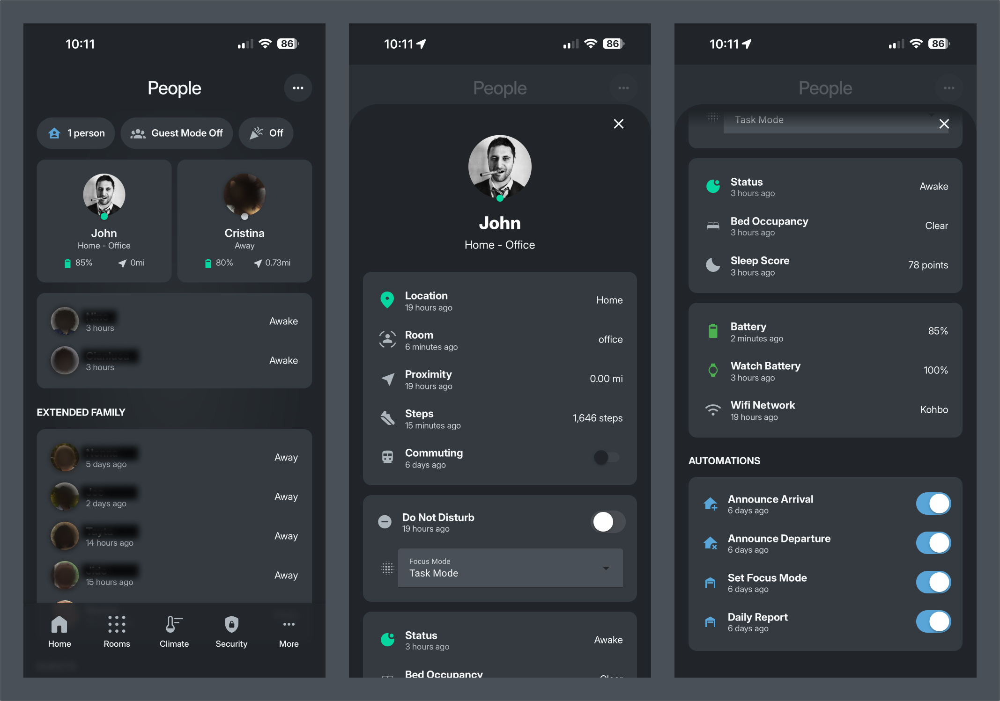

# People

[Back to main README](../README.md)

This document explains how people are modeled in my Home Assistant configuration.

## Overview

Each person in my household has a rich set of sensors and states that drive automations. Beyond the basic Home Assistant [Person integration](https://www.home-assistant.io/integrations/person/), I've created custom template sensors that aggregate multiple data points into a single "person sensor."

---

## Person Sensor

The person sensor extends the standard person entity with additional attributes useful for automations.

```yaml
template:
  - sensor:
      - name: "John Person"
        unique_id: john_person
        state: "{{ states.person.john_koht.state }}"
        attributes:
          unlock_privilege: "{{ states.input_boolean.john_unlock_privilege.state }}"
          fingerprint_id: !secret john_fingerprint_id
          avatar: "{{ states.person.john_koht.attributes.entity_picture }}"
          room_presence: "{{ states.sensor.john_room_presence.state }}"
```

| Attribute | Description |
|-----------|-------------|
| `state` | Home/Away status from the base person entity |
| `unlock_privilege` | Whether this person can unlock doors |
| `fingerprint_id` | Biometric ID for fingerprint locks |
| `avatar` | Profile picture URL |
| `room_presence` | Current room based on BLE tracking |

---

## Key States

Each person has several states tracked through `input_select` entities:

| State Type | Options | Purpose |
|------------|---------|---------|
| **Home Status** | Home, Away, Just Arrived, Just Left | Presence with transition states |
| **Sleep Status** | Awake, Just Laid Down, Sleep, Just Got Up | Sleep tracking for bedroom automations |

The "Just Arrived" and "Just Left" states, inspired by [Phil Hawthorne's methodology](https://philhawthorne.com/making-home-assistants-presence-detection-not-so-binary/), prevent false automations when someone briefly leaves and returns (e.g., taking out trash, getting something from the car).

---

## Anatomy of a Person: John

Here's how a typical day flows through the system, showing how person states drive automations throughout the house.

### Morning Wake Up (6:45 AM)

The FSR sensor on my bed detects I'm no longer lying down. My sleep state transitions:

**Sleep** → **Just Got Up** → **Awake**

This triggers a cascade:
- Main bedroom transitions from **Bedtime** to **Wake** mode
- Lights gradually brighten (sunrise simulation)
- After a few minutes, the bedroom returns to **Auto** mode

Meanwhile, the house checks: *Is everybody awake?* If my wife is also up, `sensor.everybody_awake` becomes true, and the house exits **Bedtime** mode.

### Leaving for Work (8:15 AM)

I grab my keys and head out. The system detects I've left:

**Home** → **Just Left**

The house announces: *"John just left"*

After ~5 minutes with no return:

**Just Left** → **Away**

The house checks: *Is anybody still home?* If my wife left earlier, `input_boolean.house_occupied` turns off, triggering:
- All rooms transition to **Away** mode
- Lights turn off throughout
- Alarm panel arms
- Doors lock

### Arriving Home (5:30 PM)

My phone's GPS crosses the home zone. The companion app reports I'm home:

**Away** → **Just Arrived**

Automations fire immediately:
- Garage door opens (detected I'm arriving by car)
- Garage and mudroom lights turn on
- House announces: *"John just arrived"*

After ~5 minutes:

**Just Arrived** → **Home**

### Evening - Do Not Disturb (7:00 PM)

I hop on a video call in the office. My laptop camera turns on, and my calendar shows a meeting:

`input_boolean.john_dnd` → **on**

The Office responds by entering **DnD** mode:
- Music stops
- Red light turns on outside the office
- TTS messages are blocked to office speakers

When the call ends and my camera turns off:

`input_boolean.john_dnd` → **off**

The Office returns to **Auto** mode.

### Bedtime (10:30 PM)

I get into bed. The FSR sensor detects occupancy:

**Awake** → **Just Laid Down** → **Sleep**

The main bedroom transitions to **Bedtime** mode:
- Lights dim to nightlight level
- TTS disabled
- Motion automations adjusted for nighttime

The house checks: *Is everybody sleeping?* When my wife also goes to bed, `sensor.everybody_sleeping` becomes true:
- House enters **Bedtime** mode
- All non-bedroom rooms turn off
- Alarm panel arms (night mode)
- Doors verified locked

---

## House-Level Sensors

These sensors aggregate individual person states:

| Sensor | Description |
|--------|-------------|
| `sensor.anybody_sleeping` | True if any person is asleep |
| `sensor.everybody_sleeping` | True if all persons are asleep |
| `sensor.everybody_awake` | True if all persons are awake |
| `input_boolean.house_occupied` | True if anyone is home |

---

## File Structure

```
packages/people/john/
├── presence/
│   ├── john_person.yaml           # Person sensor template
│   └── john_status.yaml           # input_select for home status
├── sleep/
│   ├── john_sleep_status.yaml     # input_select for sleep
│   ├── john_just_laid_down.yaml   # Automation: bed occupied
│   └── john_just_got_up.yaml      # Automation: bed vacant
├── commute/
│   ├── john_left_home.yaml        # Departure automation
│   ├── john_arrived_home.yaml     # Arrival automation
│   ├── john_left_work.yaml        # Left work notification
│   └── john_arrived_work.yaml     # Arrived at work notification
└── input_boolean/
    ├── john_home_boolean.yaml     # Simple home/away flag
    └── john_dnd.yaml              # Do Not Disturb toggle
```

---

## Dashboard



The Kohbo dashboard shows each person with their avatar, current location, room presence, and status indicators.

See [Dashboard Documentation](../dashboards/README.md) for details.
